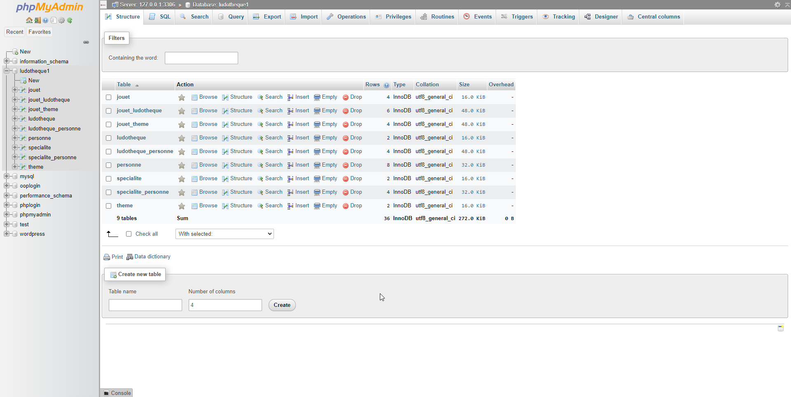
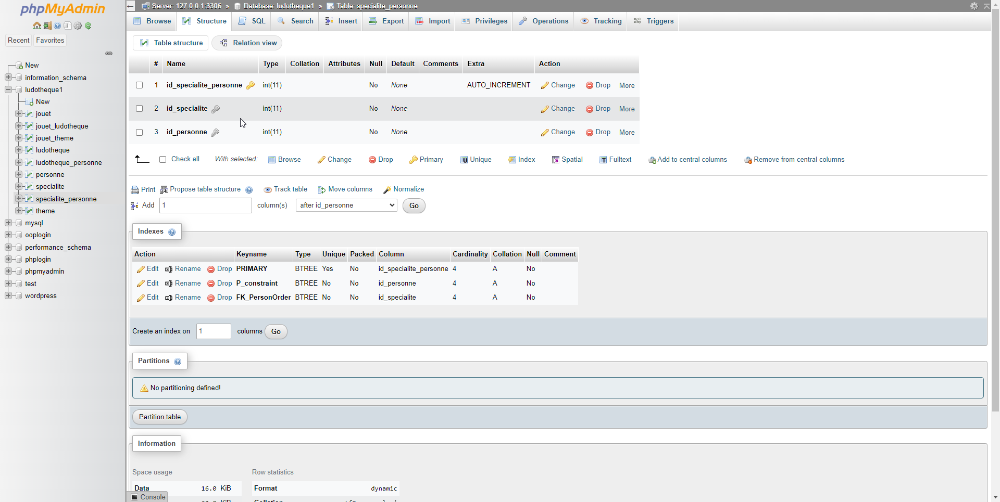
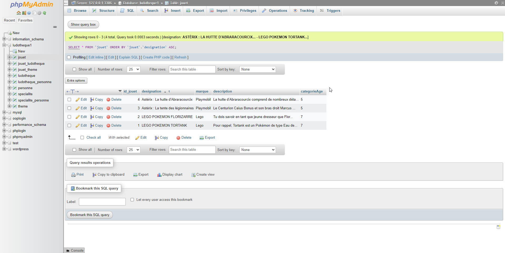
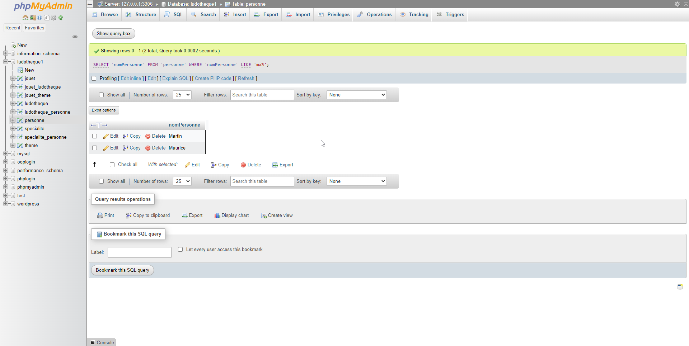
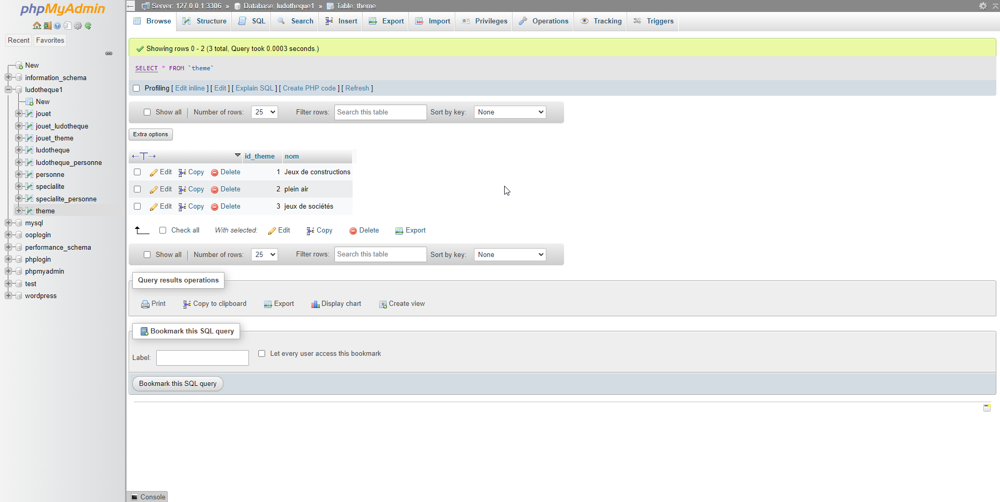
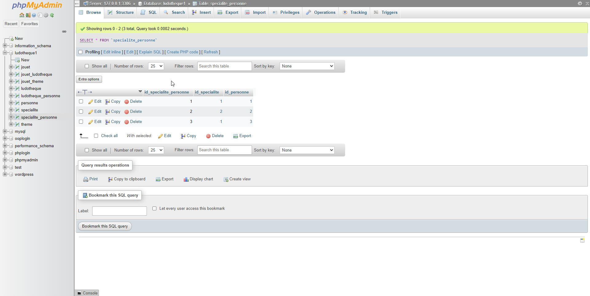
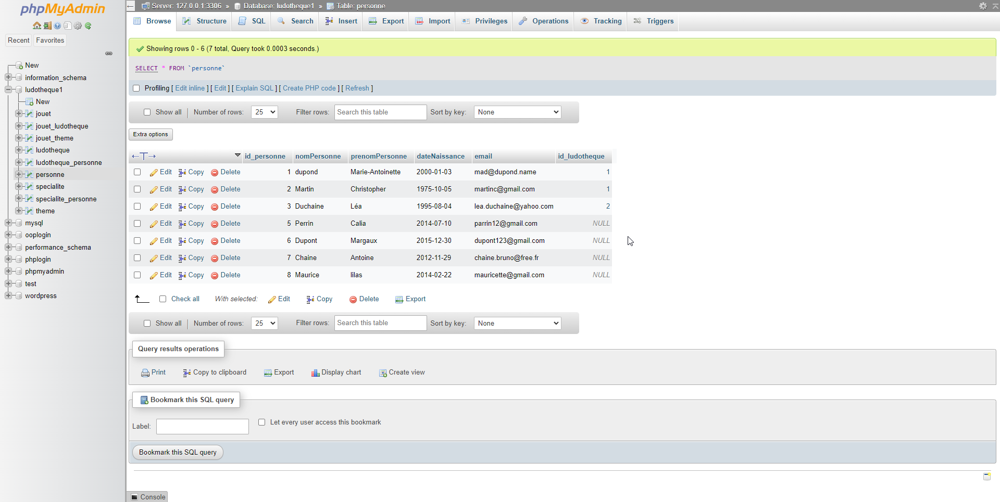

# upgraded-octo-chainsaw

## Import de la BDD



## SQL

### 1 Ajoutez une contrainte qui permet de dire que la colonne id_specialite de la table specialite_personne est une clé secondaire et correspond à la clé primaire id_specialite de la table specialite

```sql
ALTER TABLE specialite_personne
ADD CONSTRAINT FK_PersonOrder
FOREIGN KEY (id_specialite) REFERENCES specialite(id_specialite);
```



### Listez par ordre alphabétique sur la designation et sans redondance tous les jouets

```sql
SELECT * FROM `jouet` ORDER BY `jouet`.`designation` ASC
```



### Comptez le nombre de personnes mineures

```sql
SELECT COUNT(*) AS nombre_mineurs FROM personne WHERE DATEDIFF(CURRENT_DATE, dateNaissance) < 6570;

```



### Ajoutez dans la table theme un nouveau thème appelé « jeux de sociétés »

```sql
INSERT INTO `theme` (`id_theme`, `nom`) VALUES (NULL, 'jeux de sociétés')
```



### Martin Pascale change d’orientation professionnelle et quitte son travail actuel. Supprimez-la de la table personne. Est-ce qu’il y a un changement dans la table specialite_personne ? Expliquez

```sql
DELETE FROM personne WHERE `personne`.`id_personne` = 4
```

Oui la table specialite_personne change
car la contrainte de foreign key fait que la reference precedente
Martin Pascale (id=4) est indisponible donc c'est supprimé



### Modifiez l’adresse mail de Marie-Antoinette Dupond de « ma@dupond.name » à « mad@dupond.name »

```sql
UPDATE `personne` SET `email` = 'mad@dupond.name' WHERE `personne`.`id_personne` = 1;
```



### Listez toutes les personnes dont le prénom commence par « ma »

```sql
SELECT `nomPersonne` FROM `personne` WHERE `nomPersonne` LIKE 'ma%';
```


### Utilisez une requête imbriquée pour changer de lieu de travail de « Martin Christopher » : il passe de « La ludo » à « Ludido »

```sql
UPDATE `ludotheque` SET `nom` = 'Ludido' WHERE `ludotheque`.`id_ludotheque` = ( SELECT `id_ludotheque` FROM `personne` WHERE `id_personne` = 2 );
```

